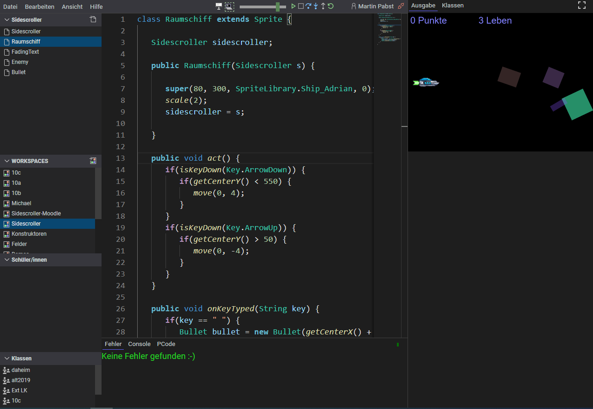

# Online-IDE
Java-ähnliche Programmiersprache (Compiler, Interpreter, Debugger) mit IDE, die **komplett im Browser** ausgeführt wird.

Die IDE gibt es in zwei Varianten: als **Online-IDE für Schulen** (kommerziell) zur Verwendung im Unterricht und bei den Schüler/innen zuhause sowie als kleine **[Embedded-IDE](#2-embedded-ide)** (Open Source, GNU GPL v3), die in beliebige Webseiten eingebunden werden kann und mit der beispielsweise Informatiklehrkräfte begleitend zum Unterricht eine interaktive Dokumentation für die Schüler/innen erstellen können, [ähnlich wie LearnJ](https://www.learnj.de).

## 1. Online-IDE für Schulen

Mit der Online-IDE können Schüler/innen im Browser [in einer Java-ähnlichen Programiersprache](https://www.learnj.de/doku.php?id=unterschiede_zu_java:start) programmieren. Die Programme werden auf dem Server gespeichert, so dass zuhause dieselbe Programmierumgebung bereitsteht wie in der Schule - ganz ohne Installation.

Die Lehrkraft hat Zugriff auf die Workspaces der Schüler/innen, so dass sie Hausaufgaben bequem korrigieren und bei Programmfehlern schnell helfen kann.

**Weitere Features**:
  - Integriertes Repository für Gruppenarbeiten
  - Code-Vervollständigung, Parameterhilfe, Refactor->Rename, Anzeige von Referenzen usw. wie in jeder modernen Entwicklungsumgebung
  - Automatisches Kompilieren und Fehleranzeige während der Eingabe
  - Schneller Programmstart ("Play-Button")
  - Ausführungsgeschwindigkeit regelbar
  - Debugger mit Breakpoints, Anzeige der lokalen Variablen, Watch-Expressions
  - Ausführung wahlweise im Einzelschritt
  - Console-Fenster zur Eingabe und sofortigen Ausführung einzelner Anweisungen
  - Schneller, bequemer Hausaufgaben-Workflow


## 2. Embedded-IDE
Die Java-ähnliche Programmiersprache ist im [LearnJ-Wiki](https://www.learnj.de) ausführlich beschrieben und dort ist die IDE in Embedded-Form auch vielfach zu sehen. Hier [ein schönes Beispiel des vollen Funktionsumfangs!](https://www.learnj.de/doku.php?id=api:documentation:grafik:animation#beispiel_4feuerwerk)

## Integration in eigene Webseiten
Benötigt werden
  - htdocs/assets/*
  - htdocs/js.webpack/javaOnlineEmbedded*
  - htdocs/js.webpack/javaOnline-embedded*
  - htdocs/lib/*
  - src/client/runtimelibrary/graphics/Spritelibrary.js

Im Header der Webseite müssen die verwendeten Bibliotheken geladen werden:
```html
<head>
    <meta charset='utf-8'>
    <title>Embedded-Test</title>
    <meta name='viewport' content='width=device-width, initial-scale=1'>

    <link rel="preload" href="lib/monaco-editor/dev/vs/editor/editor.main.js" as="script">
    <link rel="preload" href="lib/monaco-editor/dev/vs/editor/editor.main.nls.de.js" as="script">

    <script src="lib/pixijs/pixi.js"></script>

    <link rel='stylesheet' type='text/css' media='screen' href='js.webpack/javaOnlineEmbedded.css'>
    <script src="lib/jquery/jquery-3.3.1.js"></script>
    <script src="lib/markdownit/markdownit.min.js"></script>
    <script src="lib/monaco-editor/dev/vs/loader.js"></script>
    <script src="js/runtimelibrary/graphics/SpriteLibrary.js"></script>
    <script src="lib/howler/howler.core.min.js"></script>
    <script src="lib/p5.js/p5.js"></script>

    <script type="module" src="js.webpack/javaOnline-embedded.js"></script>

</head>
```

Die Bestandteile des verwendeten Monaco Editors werden dynamisch aus dem Unterverzeichnis `lib/monaco-editor/dev`nachgeladen. Falls dieser Ort ungünstig ist, kann er durch Setzen der Variablen `window.monacoEditorPath` geändert werden. Ihr Defaultwert ist `"lib/monaco-editor/dev/vs"`.

Alle divs innerhalb des `<body>`-Elements, die die Klasse `java-online` tragen, werden nach dem `DOMContentLoaded`-Event automatisch in Embedded-IDEs umgewandelt. Die Java-Quelltexte werden in `<script>`-Tags innerhalb der divs verpackt. 

### Minimal-Beispiel
```html
<div class="java-online" style="width: calc(100% - 10px); height: 150px; margin-left: 5px"
data-java-online="{
    'id': 'Beispiel_1',
    'withBottomPanel': false
}">

<script type="text/plain" title="Test1">
for(int i = 0; i < 10; i++){
    println("Das ist Zeile " + (i + 1));
}
</script>

</div>
```
Dieses Beispiel erscheint so im Browser:


### Beispiel mit Dateiliste, Console, Fehlerliste und Tipp
```html
<div class="java-online" style="width: 80%; height: 400px; margin-left: 5px" 
data-java-online="{
    'id': 'Vererbung_Beispiel_1',  
    'withBottomPanel': true, 
    'withFileList': true,
    'withPCode': true,
    'withConsole': true,
    'withErrorList': true,
    'speed': 'max'
}">

<script type="text/plain" title="Hauptprogramm.java">
World w = new World();
new Quadrat(40, 20, 300);
</script>

<script type="text/plain" title="Quadrat.java">
class Quadrat extends Rectangle {
    public Quadrat(double left, double top, double width){
        super(left, top, width, width); 
    }
}
</script>

<script type="text/plain" title="Tipp" data-type="hint">
## Tipp:
Tipps werden in einer einfachen Markdown-Syntax 
verfasst, die **Fettschrift** u.ä. ermöglicht, aber
 auch Syntax-Highlighting im Fließtext (``class Quadrat extends Rectangle { }``) 
 und in ganzen Absätzen:
/```  (den / weglassen!)
double v = Math.random()*8 + 2; // Betrag der Geschwindigkeit zwischen 2 und 10
double w = Math.random()*2*Math.PI; // Winkel zwischen 0 und 2*PI
vx = v * Math.cos(w);
vy = v * Math.sin(w);
/``` (den / weglassen!)            
</script>

</div>
```
Dieses Beispiel erscheint so im Browser:


### Das Attribut data-java-online
Im Attribut `data-java-online` kann die Embedded-IDE konfiguriert werden:
```javascript
data-java-online="{
    'id': 'Vererbung_Beispiel_1',   // eindeutige id je URL und Embedded-IDE in der IndexedDB des Browsers  
    'withBottomPanel': true,        // mit unterem Panel 
    'withFileList': true,           // falls mit unterem Panel: mit/ohne Dateiliste links
    'withPCode': true,              // falls mit unterem Panel: mit/ohne PCode-Tab
    'withConsole': true,            // falls mit unterem Panel: mit/ohne Console-Tab
    'withErrorList': true,          // falls mit unterem Panel: mit/ohne Fehlerliste
    'speed': 20000                  // Geschwindigkeit in Steps/s oder 'max'
}"
```
Ändert ein Benutzer den angezeigten Quelltext in einer Embedded-IDE, so werden die Änderungen in der IndexedDB des Browsers gespeichert. Ruft der Benutzer dieselbe Seite später mit demselben Browser erneut auf, so erscheinen seine Änderungen wieder. Rechts unten im Editor-Bereich erscheint zusätzlich ein Button "Code-Reset". Ein Klick darauf stellt den ursprünglichen Quelltext wieder her.
